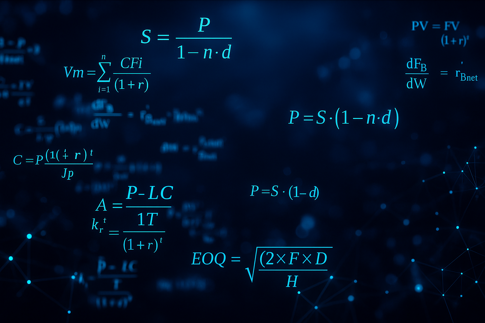

# Handbook de Gen AI Ops, Data Engineer & Data Analysis & Data Science e Inteligencia Artificial

  

---

### 🎯 **Las matemáticas son el núcleo de Data Analysis, Data Science, e Inteligencia Artificial** 🎯
  
La estadística permite entender la información.  
La probabilidad permite hacer predicciones.  
El álgebra permite construir modelos.  
El cálculo permite optimizar resultados.  

📌 ***No se trata de saberlo todo.*** 📌

Pero sí de entender lo que haces.  
Porque los datos no son magia…  
Son matemática aplicada.

---

## Índice

- [1. Disciplinas Principales de Datos e IA](#1-disciplinas-principales-de-datos-e-ia)
- [2. Roles Principales de Datos e IA](#2-roles-principales-de-datos-e-ia)
- [3. Tipos de IA](#3-tipos-de-ia)
  - [3.1. Áreas de Aplicación y Tipos de IA](#31-áreas-de-aplicación-y-tipos-de-ia)
  - [3.2. Por Nivel de Capacidad](#32-por-nivel-de-capacidad)
  - [3.3. Por Funcionamiento o Comportamiento](#33-por-funcionamiento-o-comportamiento)
  - [3.4. Por Técnica o Aplicación](#34-por-técnica-o-aplicación)
  - [3.5. Por Enfoque de Desarrollo](#35-por-enfoque-de-desarrollo)
- [4. Conceptos Generales de Desarrollo de Software](#4-conceptos-generales-de-desarrollo-de-software)
- [5. Operaciones de Despliegue Ops](#5-operaciones-de-despliegue-ops)
- [6. Fundamentos Matemáticos](#6-fundamentos-matemáticos)
  - [6.1. Fundamentos de probabilidad](#61-fundamentos-de-probabilidad)
  - [6.2. Álgebra lineal](#62-álgebra-lineal)
  - [6.3. Cálculo y Optimización](#63-cálculo-y-optimización)
- [7. Data Engineer](#7-data-engineer)
  - [7.1. Bases de Datos](#71-bases-de-datos)
  - [7.2. Infraestructura, y Plataformas](#72-infraestructura-y-plataformas)
  - [7.3. Arquitecturas de Almacenamiento de Datos](#73-arquitecturas-de-almacenamiento-de-datos)
  - [7.4. Preparación de Datos e Ingeniería de Características](#74-preparación-de-datos-e-ingeniería-de-características)
  - [7.5. Metodologías y Procesos de Datos](#75-metodologías-y-procesos-de-datos)
  - [7.6. Ingeniería, Orquestación y Gobernanza de Datos](#76-ingeniería-orquestación-y-gobernanza-de-datos)
- [8. Data Analysis](#8-data-analysis)
  - [8.1. Métricas de Rendimiento](#81-métricas-de-rendimiento)
  - [8.2. Evaluación y Validación de Modelos](#82-evaluación-y-validación-de-modelos)
  - [8.3. Análisis Exploratorio de Datos (EDA)](#83-análisis-exploratorio-de-datos-eda)
  - [8.4. Preprocesamiento y Limpieza de Datos](#84-preprocesamiento-y-limpieza-de-datos)
  - [8.5. Visualización de Resultados](#85-visualización-de-resultados)
  - [8.6. Procesos y Herramientas](#86-procesos-y-herramientas)
  - [8.7. Reporting y Comunicación](#87-reporting-y-comunicación)
- [9. Data Science](#9-data-science)
  - [9.1. Modelos de Regresión y Técnicas Paramétricas](#91-modelos-de-regresión-y-técnicas-paramétricas)
  - [9.2. Métodos Bayesianos y Probabilísticos](#92-métodos-bayesianos-y-probabilísticos)
  - [9.3. Técnicas de Optimización y Análisis Numérico](#93-técnicas-de-optimizacion-y-análisis-numérico)
  - [9.4. Técnicas de Remuestreo y Reducción de Dimensionalidad](#94-técnicas-de-remuestreo-y-reducción-de-dimensionalidad)
  - [9.5. Árboles, Ensambles y Métodos Avanzados de Clasificación](#95-árboles-ensambles-y-métodos-avanzados-de-clasificación)
  - [9.6. Algoritmos de Asociación y Ranking](#96-algoritmos-de-asociación-y-ranking)
  - [9.7. Validación, Generalización y Ensambles](#97-validación-generalización-y-ensambles)
  - [9.8. Cambios en los Datos y su Distribución](#98-cambios-en-los-datos-y-su-distribución)
  - [9.9. Preprocesamiento y Escalado de Datos](#99-preprocesamiento-y-escalado-de-datos)
- [10. Machine Learning](#10-machine-learning)
  - [10.2. Transferencia y Generalización](#102-transferencia-y-generalización)
  - [10.3. Algoritmos de Clasificación Supervisada](#103-algoritmos-de-clasificación-supervisada)
  - [10.4. Algoritmos de Regresión Supervisada](#104-algoritmos-de-regresión-supervisada)
  - [10.5. Algoritmos de Agrupamiento (Clustering)](#105-algoritmos-de-agrupamiento-clustering)
  - [10.6. Reducción de Dimensionalidad y Visualización](#106-reducción-de-dimensionalidad-y-visualización)
  - [10.7. Redes Neuronales y Deep Learning](#107-redes-neuronales-y-deep-learning)
  - [10.8. Modelos Generativos](#108-modelos-generativos)
  - [10.9. Técnicas de Ensamble y Boosting](#109-técnicas-de-ensamble-y-boosting)
  - [10.10. Técnicas de Regularización y Generalización](#1010-técnicas-de-regularización-y-generalización)
  - [10.11. Evaluación y Métricas](#1011-evaluación-y-métricas)
  - [10.12. Sistemas de Recomendación](#1012-sistemas-de-recomendación)
- [11. Deep Learning](#11-deep-learning)
  - [11.2. Redes para Datos Secuenciales (RNNs)](#112-redes-para-datos-secuenciales-rnns)
  - [11.3. Redes para Visión por Computadora](#113-redes-para-visión-por-computadora)
  - [11.4. Aprendizaje en Secuencia y Lenguaje](#114-aprendizaje-en-secuencia-y-lenguaje)
  - [11.5. Deep Reinforcement Learning](#115-deep-reinforcement-learning)
  - [11.6. Modelos Generativos](#116-modelos-generativos)
  - [11.7. Métricas de Evaluación en Deep Learning](#117-métricas-de-evaluación-en-deep-learning)
  - [11.8. Optimización y Regularización](#118-optimizacion-y-regularización)
  - [11.9. Algoritmos y Frameworks de Deep Learning](#119-algoritmos-y-frameworks-de-deep-learning)
- [12. NLP y Large Language Models](#12-nlp-y-large-language-models)
  - [12.1. Introducción a NLP y LLMs](#121-introducción-a-nlp-y-llms)
  - [12.2. Frameworks a NLP y LLMs](#122-frameworks-a-nlp-y-llms)
- [13. Frameworks de NLP, y Large Language Models](#13-frameworks-de-nlp-y-large-language-models)
- [14. Servicios de AI en AWS](#14-servicios-de-ai-en-aws)
- [15. Frameworks de Automatización](#15-frameworks-de-automatizacion)
- [16. Evaluación e Interpretabilidad de Modelos](#16-evaluación-e-interpretabilidad-de-modelos)
- [17. Despliegue](#17-despliegue)
- [18. Orquestación](#18-orquestación)
- [19. Monitoreo](#19-monitoreo)

375 Temas - 70 Categorias

---

## 1. Disciplinas Principales de Datos e IA

-   Data Engineer: Proceso de diseñar, construir y mantener la infraestructura para la recolección, almacenamiento y procesamiento de datos a gran escala.

-   Data Analysis: Proceso de inspeccionar, limpiar y modelar datos para descubrir información útil y apoyar la toma de decisiones.

-   Data Science: Disciplina que combina estadística, programación y conocimiento del dominio para extraer conocimiento y generar predicciones a partir de datos.

-   Dev Ops: Conjunto de prácticas que combinan desarrollo de software y operaciones de TI para mejorar colaboración, automatización y entrega rápida y confiable.

-   Data Ops: Metodología que integra ingeniería de datos y operaciones para mejorar eficiencia, calidad y colaboración en la gestión y análisis de datos.

-   MLOps: Conjunto de prácticas para automatizar, desplegar y monitorizar modelos de Machine Learning en producción de forma escalable y confiable.

-   AI Ops: Uso de IA, aprendizaje automático y analítica de grandes datos para automatizar y mejorar operaciones de TI, como detección de anomalías.

-   Gen AI Ops: Prácticas y procesos para operacionalizar sistemas de IA generativa, enfocándose en despliegue, gestión, escalabilidad y gobernanza.

---

## 2. Roles Principales de Datos e IA

-   Ingeniero de Datos: Proceso de diseñar, construir y mantener la infraestructura para la recolección, almacenamiento y procesamiento de datos a gran escala.

-   Analista de Datos: Proceso de inspeccionar, limpiar y modelar datos para descubrir información útil y apoyar la toma de decisiones.

-   Científico de Datos: Rol que combina estadística, programación y conocimiento del dominio para extraer conocimiento y generar predicciones a partir de datos.

-   Ingeniero DevOps: Conjunto de prácticas que combinan desarrollo de software y operaciones de TI para mejorar colaboración, automatización y entrega rápida y confiable.

-   Ingeniero DataOps: Rol que integra ingeniería de datos y operaciones para mejorar eficiencia, calidad y colaboración en la gestión y análisis de datos.

-   Ingeniero MLOps: Conjunto de prácticas para automatizar, desplegar y monitorizar modelos de Machine Learning en producción de forma escalable y confiable.

-   Ingeniero AIOps: Uso de IA, aprendizaje automático y analítica de grandes datos para automatizar y mejorar operaciones de TI, como detección de anomalías.

-   Ingeniero GenAIOps: Prácticas y procesos para operacionalizar sistemas de IA generativa, enfocándose en despliegue, gestión, escalabilidad y gobernanza.

---

## 3. Tipos de IA

### 🧠 3.1. Áreas de Aplicación y Tipos de IA

-   Natural Language Processing (NLP): Rama de la IA que se enfoca en la interacción entre computadoras y lenguaje humano, incluyendo tareas como análisis de sentimientos y traducción automática.

-   Computer Vision: Área de la IA dedicada a que las máquinas “vean” y interpreten imágenes y videos, con aplicaciones en reconocimiento de objetos y segmentación.

-   Time Series Analysis: Métodos para modelar y predecir datos ordenados en el tiempo, como pronósticos de ventas o mediciones de sensores.

-   Anomaly Detection: Identificación de patrones atípicos o inusuales en los datos, útil para detección de fraudes o fallos de maquinaria.

-   Recommendation Systems: Sistemas que sugieren productos o contenidos personalizados basados en el comportamiento y preferencias del usuario.

-   Sentiment Analysis: Técnica que analiza textos para detectar la emoción o actitud del autor, como positiva, negativa o neutral. Es una aplicación común del NLP.

-   Graph Analytics: Análisis de datos estructurados como grafos (nodos y aristas), usado en redes sociales, detección de fraudes y optimización de rutas.

-   Generative AI: Modelos (p. ej., GANs, VAEs) capaces de crear nuevo contenido (imágenes, texto, audio) similar a los datos de entrenamiento.

-   ChatBot: Programa que simula una conversación humana, respondiendo automáticamente a preguntas o comandos de usuarios.

-   Agente de IA: Sistema autónomo basado en inteligencia artificial que percibe su entorno, toma decisiones y actúa para cumplir objetivos definidos.

-   Automatización (Airflow, Prefect): Orquestación de tareas y dependencias.

-   Series Temporales: Conjunto de datos ordenados en el tiempo, utilizados para analizar y predecir patrones o tendencias a lo largo de un período. 

-   Grafos: Estructuras de datos compuestas por nodos y aristas que representan relaciones entre entidades, utilizadas en análisis de redes y algoritmos de optimización. 

-   Supply Chain (Operaciones Comerciales, Distribución, Transporte): Sistema que gestiona el flujo de bienes y servicios desde el origen hasta el consumidor, involucrando operaciones, distribución y transporte. 

### 🧠 3.2. Por Nivel de Capacidad

-   IA Débil / Estrecha: Solo realiza tareas específicas y no tiene conciencia ni entendimiento. Ejemplos incluyen asistentes virtuales como Siri y sistemas de recomendación.

-   IA General (AGI): Capaz de aprender y razonar de manera similar a un ser humano, pero aún no existe.

-   IA Superinteligente (ASI): Supera la inteligencia humana en todos los aspectos y es teórica por ahora.

### ⚙️ 3.3. Por Funcionamiento o Comportamiento

-   IA Reactiva: Responde a estímulos actuales sin utilizar memoria. Un ejemplo es Deep Blue, el sistema de ajedrez.

-   IA con Memoria Limitada: Utiliza datos pasados para tomar decisiones actuales. Ejemplos incluyen coches autónomos.

-   IA con Teoría de la Mente: Capaz de entender emociones e intenciones humanas, pero aún está en desarrollo.

-   IA Autoconsciente: Posee conciencia de sí misma, pero es un concepto hipotético.

### 🛠️ 3.4. Por Técnica o Aplicación

-   IA Generativa: Crea contenido nuevo como texto, imágenes, audio o video. Ejemplos son ChatGPT y DALL·E.

-   IA Predictiva: Anticipa eventos futuros a partir de datos pasados, como en la predicción de ventas.

-   IA Cognitiva: Simula el pensamiento humano, incluyendo razonamiento, aprendizaje y toma de decisiones. Un ejemplo es IBM Watson.

-   IA Conversacional: Interactúa con usuarios mediante lenguaje natural, como chatbots y asistentes virtuales.

-   IA Perceptual: Interpreta el mundo físico a través de visión, sonido y sensores, como en el reconocimiento facial.

-   IA Explicable (XAI): Sus decisiones pueden ser entendidas fácilmente, utilizada en campos como medicina y derecho.

-   IA Híbrida: Combina varios enfoques, como sistemas expertos y machine learning.

-   IA Evolutiva: Utiliza algoritmos inspirados en la biología para aprender, como los algoritmos genéticos.

### 🧬 3.5. Por Enfoque de Desarrollo

-   IA Simbólica GOFAI (Good Old-Fashioned Artificial Intelligence): Enfoque clásico de IA basado en símbolos, lógica y reglas explícitas, como en sistemas expertos, en contraste con métodos modernos basados en datos.

-   IA Basada en Datos (Machine Learning): Aprende patrones a partir de datos masivos, como en el reconocimiento de imágenes.

-   IA Basada en Conocimiento: Utiliza bases de conocimiento estructuradas, como ontologías.

---

## 4. Conceptos Generales de Desarrollo de Software

-   API (Application Programming Interface): Conjunto de definiciones y protocolos que permiten la comunicación e integración entre diferentes componentes de software.

-   SDK (Software Development Kit): Paquete de herramientas, bibliotecas y documentación que facilita el desarrollo de aplicaciones sobre una plataforma o tecnología concreta.

-   Trigger: Mecanismo que, al cumplirse una condición (por ejemplo, llegada de un dato o evento), inicia automáticamente una acción o flujo de trabajo en un sistema o agente de IA.

-   Checkpoints:  Estado guardado de parámetros de un modelo durante entrenamiento para reanudar o usar después.

-   EndPoint: Punto de acceso a un servicio web o API que permite a los usuarios o sistemas interactuar con un modelo, aplicación o base de datos mediante solicitudes HTTP.

-   Webhook: Punto de llamada HTTP que permite a una aplicación recibir notificaciones en tiempo real cuando ocurra un evento específico en otro servicio.

-   API Key: Identificador único para autenticar y autorizar acceso a APIs.

-   SaaS: Modelo de software como servicio, proporcionado vía internet bajo suscripción.

-   MaaS: Servicio basado en la nube para acceder a modelos de machine learning preentrenados vía APIs.

-   Framework:	Plataforma reutilizable para desarrollar aplicaciones, ofreciendo componentes y directrices.

-   SSL:	Tecnología de seguridad para enlaces encriptados entre servidores web y navegadores.SSL	Tecnología de seguridad para enlaces encriptados entre servidores web y navegadores.

-   TLS: Protocolo criptográfico para comunicaciones seguras, protegiendo tráfico web.

-   GraphQL: Lenguaje de consulta para APIs, permitiendo especificar datos exactos en una solicitud.

-   P2P:	Modelo de red distribuida donde participantes comparten recursos directamente.

-   Funciones Lambda: Funciones anónimas y de una sola línea en programación que se utilizan para operaciones simples y rápidas, comunes en el procesamiento de datos y flujos de trabajo. 

-   API Layer: Capa de software que expone funcionalidades de un sistema a través de una API, permitiendo la integración y comunicación entre diferentes aplicaciones.

---

## 5. Operaciones de Despliegue Ops

-   Ops: Prácticas y herramientas que automatizan y estandarizan procesos en el ciclo de vida del software (o de modelos), incluyendo versionado, reproducibilidad, seguridad, monitoreo y análisis.

-   Docker: Contenedores de software para aislamiento y portabilidad de aplicaciones, facilitando despliegue y escalabilidad.

-   Kubernetes para MLOps: Orquestador de contenedores que facilita el despliegue y escalado de modelos en producción.

-   Microservicios: Arquitectura de software que divide una aplicación en servicios independientes, desplegables y es

-   CI/CD (Integración Continua / Entrega Continua): Prácticas y herramientas que automatizan la compilación, prueba y despliegue de software para garantizar entregas frecuentes y fiables.

-   Model Serving: Proceso y sistemas dedicados a poner en producción modelos de Machine Learning, facilitando su consulta en tiempo real o por lotes.

-   Canary Deployment: Estrategia de despliegue gradual donde una nueva versión de software se libera a un pequeño porcentaje de usuarios antes de un lanzamiento completo.

-   Blue-Green Deployment: Método de despliegue que mantiene dos entornos (azul y verde) para alternar tráfico entre versiones sin tiempo de inactividad.

-   AutoML: Automatización de todo el flujo de trabajo de Machine Learning, desde la selección de características hasta el ajuste de hiperparámetros.

-   Guardarraíles: Mecanismos de seguridad para asegurar ética y evitar contenido perjudicial en IA.

-   HITL: Metodología que incorpora intervención humana en sistemas de IA para mejorar precisión.

-   Latencia: Tiempo que tarda un sistema en responder a una solicitud, crítico en aplicaciones en tiempo real como inferencia de modelos en producción. Categoría: 5. Operaciones de Despliegue Ops

---

## 6. Fundamentos Matemáticos

### 6.1 Fundamentos de probabilidad

- Variables aleatorias e independencia estadística: Una variable aleatoria asigna valores a resultados de un experimento. La independencia significa que conocer una no cambia la probabilidad de la otra 

- Momentos estadísticos y regresiones de Poisson: Los momentos (media, varianza, etc.) caracterizan distribuciones; la regresión de Poisson modela recuentos como función de variables explicativas.

- Ley de los grandes números y Teorema límite central: Con suficientes datos, la media muestral se acerca a la real; la suma de variables independientes converge a una distribución normal.

- Test estadísticos: Métodos que contrastan hipótesis usando datos y distribuciones de probabilidad.

- Cadenas de Markov / PageRank: Proceso donde cada estado depende solo del anterior. PageRank estima la “importancia” de páginas como estado estacionario 

### 6.2 Álgebra lineal

- Sistemas de ecuaciones lineales: Conjuntos de ecuaciones que pueden resolverse con matrices o determinantes.

- Similitud del coseno y geometría lineal: Medida de semejanza entre vectores por el ángulo entre ellos.

- Análisis de componentes principales: Reduce dimensiones encontrando direcciones de máxima varianza.

- Descomposición en valores singulares: Factoriza una matriz en U·Σ·V* para reducir ruido o comprimir datos 

- Auto-vectores y auto-valores: Vectores que solo cambian de escala por una matriz; valores que indican esa escala.

- Álgebra lineal numérica: Métodos computacionales para ecuaciones, descomposición y valores propios.

### 6.3 Cálculo y Optimización

- Optimización lineal y método simplex: Maximiza/minimiza una función lineal con restricciones lineales usando algoritmos tipo simplex.

- Derivadas, Método de Cauchy y Convexidad: Derivadas informan sobre pendientes; optimización para funciones convexas garantiza mínimos globales.

- Gradient Boosting & SGD: Métodos iterativos que ajustan modelos mejorando errores previos o actualizan parámetros por gradiente.

- Back-propagation y redes profundas: Cálculo eficiente de gradientes para entrenar redes neuronales profundas.

- Programación dinámica y refuerzo: Métodos que descomponen problemas en subproblemas; en refuerzo maximizan recompensas acumuladas.

- Teorema de Policy Gradient: Establece cómo estimar el gradiente de la recompensa esperada para mejorar políticas en aprendizaje por refuerzo

---

## 7. Data Engineer

### 7.1. Bases de Datos

-   Excel, CSV, JSON: Formatos de archivo para datos estructurados.

-   Relational Databases: Bases de datos estructuradas en tablas con esquemas fijos y relaciones definidas por llaves primarias y foráneas; utilizan SQL para consultas.

-   NoSQL Database: Sistema de gestión de datos no relacional, diseñado para alta escalabilidad y flexibilidad de esquemas; incluye tipos como documento, clave-valor, columna y grafo.

-   Graph DataBases

-   Vectorial Database: Base de datos optimizada para almacenar y buscar vectores (embeddings), facilitando búsquedas semánticas y aplicaciones de RAG.

-   Joins: Operaciones en bases de datos que combinan filas de dos o más tablas basadas en columnas relacionadas, como inner join, left join, etc. 

### 7.2. Infraestructura, y Plataformas 

-   Big Data: Conjunto de tecnologías y prácticas para almacenar y procesar volúmenes masivos de datos (las “3 V”: volumen, velocidad y variedad).sis de grandes volúmenes de datos de forma rápida.calables de forma autónoma.

-   On-Premise vs Cloud Computing: Contraste entre infraestructuras locales (servidores propios) y servicios de nube pública o privada para el almacenamiento y procesamiento de datos.

-   Edge AI: Despliegue de inferencia y/o entrenamiento de modelos de IA directamente en dispositivos periféricos (sensores, smartphones) en lugar de la nube.

-   AWS bucket: Servicio de almacenamiento escalable de Amazon S3 para guardar y recuperar datos.

-   Apache Spark: Plataforma de procesamiento distribuido en memoria para análisis de grandes volúmenes de datos de forma rápida.calables de forma autónoma.

-   PySpark: Biblioteca de Python que permite el procesamiento distribuido de datos a gran escala utilizando Apache Spark, facilitando el manejo de Big Data. 

### 7.3. Arquitecturas de Almacenamiento de Datos

-   Data Set: Colección organizada de datos, generalmente en forma de tablas, utilizada para análisis, entrenamiento de modelos o visualización. 

-   Data Frame: Estructura de datos bidimensional similar a una tabla, utilizada en bibliotecas como Pandas para manipular y analizar datos de manera eficiente.

-   OLAP Cubes: Estructura de datos multidimensional para análisis rápido en procesamiento analítico en línea (OLAP), usada en inteligencia de negocios.

-   Data Fabric: Arquitectura unificada que integra y gestiona datos en entornos híbridos y multicloud, ofreciendo acceso gobernado y consistente.

-   Data Mesh: Enfoque descentralizado que organiza la gestión de datos por dominios de negocio, con equipos responsables de sus propios “productos de datos”.

-   Data Lake: Almacén centralizado que guarda grandes volúmenes de datos en su formato nativo (estructurado, semiestructurado o no estructurado).

-   Data Mart: Subconjunto especializado de un Data Warehouse orientado a las necesidades de un área o departamento específico.

-   Data Store: Cualquier sistema donde se guardan datos, desde ficheros planos y bases de datos hasta lagos y almacenes de datos.

-   Data Warehouse: Repositorio centralizado que almacena datos integrados de múltiples fuentes, optimizado para consultas analíticas y generación de informes.

-   Data Lakehouse: Arquitectura híbrida que combina características de Data Lake (flexibilidad de formatos) y Data Warehouse (optimizaciones para BI y consultas SQL).

-   Feature Store: Repositorio centralizado para almacenar, gestionar y servir features (atributos) en producción de manera consistente entre entrenamiento y despliegue.

-   Knowledge Graphs: Representación estructurada de entidades y sus relaciones para mejorar búsquedas, recomendaciones y razonamiento semántico.

-   RDD (Resilient Distributed Dataset): Estructura de datos fundamental en Apache Spark que permite el procesamiento paralelo y tolerante a fallos de grandes volúmenes de datos en clústeres.

### 7.4. Preparación de Datos e Ingeniería de Características

-   Modelado de Datos y Arquitecturas ETL/SSRS/SSIS/SSAS: Proお客様ceso de diseñar estructuras de datos y flujos de trabajo para la extracción (ETL), reporting (SSRS), integración (SSIS) y análisis (SSAS) en entornos de Business Intelligence.

-   Feature Engineering: Proceso de crear y seleccionar variables (features) relevantes a partir de los datos crudos para mejorar el rendimiento de los modelos.

-   Synthetic Data: Datos generados artificialmente que imitan las propiedades estadísticas de datos reales, para entrenar o validar modelos.

-   SMOTE (Synthetic Minority Over-sampling Technique): Método para balancear clases en datasets desequilibrados generando muestras sintéticas de la clase minoritaria.

-   Chunking: Técnica de NLP para agrupar palabras en frases correlacionadas, facilitando análisis.

### 7.5. Metodologías y Procesos de Datos

-   CRISP-DM: Metodología estándar para proyectos de Data Science que define fases: comprensión del negocio, de los datos, preparación, modelado, evaluación y despliegue.

-   EDA (Exploratory Data Analysis): Análisis preliminar de datos mediante estadísticas descriptivas y visualizaciones para entender su estructura y detectar anomalías.

-   ETL (Extract, Transform, Load): Proceso de extraer datos de fuentes diversas, transformarlos (limpieza, agregación) y cargarlos en un repositorio destino.

-   ELT (Extract, Load, Transform): Variante de ETL donde la carga al repositorio ocurre antes de las transformaciones, aprovechando potentes motores de bases de datos.

### 7.6. Ingeniería, Orquestación y Gobernanza de Datos

-   Versionado de Datos (DVC): Control de versiones de datasets y transformaciones.

-   WorkFlow: Serie de pasos o procesos ejecutados en orden para lograr un objetivo, a menudo automatizada.

-   Pipeline: Secuencia automatizada de pasos para procesar y transformar datos, como un flujo de transformación de datos, o entrenar modelos.

-   Data Pipeline: Pipeline orientado a datos que automatiza la ingesta, transformación y entrega de información a sistemas downstream.

-   Data Governance: Conjunto de políticas, procesos y estándares que aseguran la calidad, privacidad y seguridad de los datos en una organización.

-   Data Lineage: Trazabilidad del recorrido de los datos desde su origen hasta su uso final, esencial para auditoría y cumplimiento.

-   Data Quality: Medición y aseguramiento de que los datos sean completos, precisos, consistentes y oportunos.

-   Data Catalog: Registro organizado de los activos de datos de una organización, con metadatos que facilitan su descubrimiento y gobernanza.

-   Metadata Management: Conjunto de prácticas y herramientas para capturar, almacenar y mantener la información sobre los datos (origen, formato, calidad, uso).

-   Data Orchestration: Coordinación y programación de workflows de datos (ingesta, transformación, validación) para asegurar su flujo ordenado y rastreable.

---

## 8. Data Analysis 

### 8.1. Métricas de Rendimiento

-   KPI (Key Performance Indicator): Métrica clave que cuantifica el éxito de un proceso o proyecto respecto a sus objetivos.

-   Accuracy (Exactitud): Proporción de predicciones correctas sobre el total.

-   Precision (Precisión): Proporción de verdaderos positivos sobre el total de positivos predichos.

-   Recall (Sensibilidad): Proporción de verdaderos positivos sobre el total de positivos reales.

-   F1 Score: Media armónica entre precisión y recall.

-   AUC‑ROC: Área bajo la curva ROC, mide la capacidad del modelo para distinguir entre clases.

-   MAE (Mean Absolute Error): Error medio absoluto, promedia las diferencias absolutas entre predicciones y valores reales.

-   MSE (Mean Squared Error): Error cuadrático medio, promedia los cuadrados de las diferencias (penaliza más errores grandes).

-   RMSE (Root Mean Squared Error): Raíz del MSE, en las mismas unidades de la variable objetivo.

-   R² (Coeficiente de determinación): Fracción de la varianza explicada por el modelo.

-   MAPE (Mean Absolute Percentage Error): Error porcentual medio absoluto, útil en series temporales.

-   Z - Score: Medida estadística que indica cuántas desviaciones estándar un valor está por encima o por debajo de la media de un conjunto de datos. Categoría:

-   Desviación Estándar: Medida de dispersión que indica cuánto se alejan los valores de un conjunto de datos respecto a su media. 

-   PPV (Positive Predictive Value): Proporción de predicciones positivas correctas sobre el total de predicciones positivas, también conocida como precisión. 

-   TPR (Tasa de Verdaderos Positivos): Proporción de casos positivos reales correctamente identificados por el modelo, también conocida como recall o sensibilidad.

-   FPR (Tasa de Falsos Positivos): Proporción de casos negativos reales incorrectamente clasificados como positivos por el modelo.

### 8.2. Evaluación y Validación de Modelos

-   Model Evaluation: Conjunto de métricas y técnicas para medir la efectividad de un modelo en datos de prueba.

-   Confusion Matrix (Matriz de confusión): Tabla que muestra verdaderos/falsos positivos y negativos por clase.

-   Cross‑Validation: División múltiple de los datos en “folds” para validar la generalización.

-   Holdout: Separar un conjunto fijo de datos (train/test) para evaluación.

-   Stratified Sampling: Muestreo que conserva la proporción de clases en cada partición.

-   Bootstrap Validation: Remuestreo con reemplazo para estimar la variabilidad de las métricas.

-   Matriz de Confusión: Tabla que resume el rendimiento de un modelo de clasificación, mostrando verdaderos positivos, falsos positivos, verdaderos negativos y falsos negativos.

-   Curva ROC: Gráfico que muestra la relación entre la tasa de verdaderos positivos (TPR) y la tasa de falsos positivos (FPR) para evaluar el rendimiento de un clasificador.

### 8.3. Análisis Exploratorio de Datos (EDA)

-   EDA (Exploratory Data Analysis): Proceso iterativo de entender la estructura, detectar anomalías y formular hipótesis.

-   Histogramas: Gráficos de barras que muestran la distribución de una variable numérica.

-   Boxplots: Representación de cuartiles, mediana y valores atípicos de una variable.

-   Scatter Plots (Diagramas de dispersión): Relación entre dos variables numéricas.

-   Heatmap de correlación: Mapa de color que muestra correlaciones entre múltiples variables.

-   Pairplot: Matriz de scatter plots para visualizar relaciones bivariadas.

-   Resumen estadístico: Media, mediana, desviación estándar, mínimo y máximo de cada variable.

-   Outlier Detection: Identificación de valores atípicos mediante IQR, Z‑Score o métodos basados en modelos.

-   Correlación: Medida estadística que indica el grado de relación lineal entre dos variables, oscilando entre -1 (correlación negativa perfecta) y 1 (correlación positiva perfecta). 

### 8.4. Preprocesamiento y Limpieza de Datos

-   Data Cleaning: Corrección o eliminación de registros erróneos o duplicados.

-   Data Imputation: Relleno de valores faltantes (media, mediana, KNN‑imputation).

-   Data Normalization: Escalado de valores al rango [0,1] para algoritmos sensibles a magnitudes.

-   Data Standardization: Transformación para media 0 y desviación estándar 1.

-   Encoding Categórico: One‑Hot Encoding, Label Encoding, Target Encoding

-   Feature Scaling: Min‑Max, Z‑Score, Robust Scaler.

-   Feature Selection: Filter Methods (chi‑cuadrado, ANOVA), Wrapper Methods (RFE), Embedded Methods (Lasso)

### 8.5. Visualización de Resultados

-   Dashboard: Panel interactivo que agrupa gráficas y métricas clave.

-   Time Series Plot: Gráfico de líneas para datos temporales.

-   Bar Chart: Comparación de categorías discretas.

-   Pie Chart: Distribución porcentual de categorías (uso limitado).

-   Boxen Plot: Variante de boxplot para grandes volúmenes de datos.

-   Violin Plot: Combina boxplot y densidad de distribución.

-   Bullet Chart: Visualización de KPI frente a objetivos.

-   Waterfall Chart: Desglose acumulativo de valores (e.g. análisis financiero).

### 8.6. Procesos y Herramientas

-   ETL (Extract, Transform, Load): Flujo para extraer datos, transformarlos y cargarlos en un almacén.

-   ELT (Extract, Load, Transform): Variante donde la transformación se realiza en destino.

-   Pipeline de Datos: Secuencia automatizada de etapas de procesamiento.

-   Automatización (Airflow, Prefect): Orquestación de tareas y dependencias.

-   Versionado de Datos (DVC): Control de versiones de datasets y transformaciones.

-   Data Catalog: Registro de activos de datos con metadatos y linaje.

-   Data Quality: Conjuntos de reglas y métricas para asegurar precisión, completitud y consistencia.

### 8.7. Reporting y Comunicación

-   Storytelling con Datos: Técnica de narración que usa visualizaciones y hallazgos para transmitir insights.

-   Executive Summary: Resumen breve de hallazgos y recomendaciones clave para directivos.

-   Slide Deck: Presentación estructurada para exponer resultados ante stakeholders.

-   Notebook Reproducible: Documentos (Jupyter, R Markdown) que combinan código, resultados y explicaciones.

---

## 9. Data Science

### 9.1. Modelos de Regresión y Técnicas Paramétricas

-   Regresión Lineal: Técnica estadística que modela la relación entre una variable dependiente continua y una o más variables independientes, ajustando una recta.

-   Regresión Lineal Múltiple: Extensión de la regresión lineal que incorpora varias variables independientes para predecir una variable dependiente.

-   Regresión Polinómica: Variante de regresión lineal en la que la relación entre variables se modela como un polinomio de grado n.

-   Quantile Regression: Método que estima percentiles condicionales de la variable dependiente, no solo la media.

-   Elastic Net: Modelo de regresión que combina regularización L1 (Lasso) y L2 (Ridge).

-   Ordinal Regression: Variante de regresión logística para variables dependientes ordinales.

### 9.2. Métodos Bayesianos y Probabilísticos

-   Bayesian Methods: Técnicas estadísticas que aplican el teorema de Bayes para actualizar la probabilidad de una hipótesis a medida que se obtienen más datos.

-   Naive Bayes: Clasificador probabilístico basado en el teorema de Bayes con independencia entre variables.

-   Bayesian Optimization: Técnica de optimización de hiperparámetros basada en modelos probabilísticos.

### 9.3. Técnicas de Optimización y Análisis Numérico

-   Programación Lineal: Técnica de optimización matemática para maximizar o minimizar una función lineal sujeta a restricciones lineales.

-   Monte Carlo Simulation: Método estadístico para estimar resultados a través de múltiples simulaciones aleatorias.

### 9.4. Técnicas de Remuestreo y Reducción de Dimensionalidad

-   Bootstrapping: Método de remuestreo con reemplazo para estimar la distribución de una estadística sin asumir un modelo paramétrico.

-   PCA (Análisis de Componentes Principales): Técnica de reducción de dimensionalidad que transforma datos a un espacio de componentes ortogonales que capturan la mayor varianza.

-   Self-Organizing Maps (SOMs): Redes neuronales no supervisadas para reducción de dimensionalidad y agrupamiento visual.

-   Linear Discriminant Analysis (LDA): Técnica para clasificación y reducción de dimensionalidad que maximiza la separación entre clases.

### 9.5. Árboles, Ensambles y Métodos Avanzados de Clasificación

-   CatBoost: Algoritmo de gradient boosting optimizado para manejar variables categóricas sin necesidad de codificación previa.

-   LightGBM: Algoritmo de boosting eficiente en memoria, ideal para datasets grandes y de alta dimensionalidad.

-   Extra Trees (Extremely Randomized Trees): Variante del random forest que introduce mayor aleatoriedad para reducir varianza.

-   Isolation Forest: Algoritmo especializado en detección de anomalías mediante la partición aleatoria de datos.

-   Quadratic Discriminant Analysis (QDA): Clasificador que modela cada clase con su propia matriz de covarianza.

### 9.6. Algoritmos de Asociación y Ranking

-   Apriori Algorithm: Algoritmo de minería de reglas de asociación usado en análisis de mercado o cestas de compra.

-   FP-Growth: Alternativa al Apriori, más eficiente para encontrar patrones frecuentes en grandes datasets.

-   PageRank: Algoritmo desarrollado por Google para clasificar páginas web basado en enlaces entrantes.

### 9.7. Validación, Generalización y Ensambles

-   Ensemble Stacking: Técnica que combina varios modelos base utilizando un modelo meta para hacer predicciones finales.

-   Voting Classifier: Técnica de ensamblado que combina modelos mediante voto mayoritario o promedio.

-   Bagging: Método de ensamble que entrena modelos independientes en subconjuntos aleatorios de los datos.

-   Early Stopping: Técnica para detener el entrenamiento de un modelo cuando su rendimiento empieza a empeorar en datos de validación.

-   Learning Rate Scheduler: Mecanismo que ajusta automáticamente la tasa de aprendizaje durante el entrenamiento del modelo.

-   Model Calibration: Proceso para asegurar que las probabilidades estimadas por un modelo reflejan probabilidades reales.

### 9.8. Cambios en los Datos y su Distribución

-   Feature Drift: Cambio en la distribución de una feature a lo largo del tiempo, que puede afectar el rendimiento del modelo.

-   Conceptual Drift: Cambio en la relación entre variables de entrada y salida a lo largo del tiempo.

### 9.9. Preprocesamiento y Escalado de Datos

-   Shuffling: Aleatorización de los datos antes del entrenamiento para evitar patrones no deseados en el aprendizaje.

-   Data Normalization: Escalado de datos para que estén en la misma escala (p. ej., entre 0 y 1).

-   Data Standardization: Transformación para que las variables tengan media 0 y desviación estándar 1.

-   Z-Score: Medida estadística que indica cuántas desviaciones estándar está un valor respecto a la media.

---

## 10. Machine Learning

-   Machine Learning: Rama de la IA que desarrolla algoritmos capaces de aprender a partir de datos para hacer predicciones o tomar decisiones sin ser programados de manera explícita.

-   Aprendizaje Supervisado: Tipo de ML donde el modelo aprende a partir de datos etiquetados (con una respuesta conocida).

-   Aprendizaje No Supervisado: Modelo que identifica patrones o estructuras en datos sin etiquetas.

-   Aprendizaje Semi-Supervisado: Técnica que combina una pequeña cantidad de datos etiquetados con una gran cantidad de datos no etiquetados.

-   Aprendizaje por Refuerzo (Reinforcement Learning): Técnica en la que un agente interactúa con un entorno y aprende mediante recompensas o castigos.

-   Aprendizaje Online: Modelo que se entrena de manera continua con nuevos datos en tiempo real.

-   Aprendizaje Batch (por lotes): Entrenamiento del modelo con un conjunto completo de datos antes de realizar predicciones.

-   Shapes: En machine learning, se refiere a la dimensionalidad de los datos o tensores, indicando el número de filas, columnas u otras dimensiones en una estructura de datos. 

-   MNIST (Modified National Institute of Standards and Technology): Conjunto de datos estándar de imágenes de dígitos escritos a mano, utilizado para entrenar y evaluar modelos de reconocimiento de imágenes. 

-   Tagged Data: Datos etiquetados manualmente con información adicional, como categorías o anotaciones, utilizados en tareas de aprendizaje supervisado.

-   Instancias: Ejemplos individuales de datos en un conjunto, como filas en una tabla o puntos en un espacio de características.

-   Parámetro: Variable interna de un modelo que se ajusta durante el entrenamiento, como los pesos en una red neuronal. Categoría: 9. Machine Learning

### 10.2. Transferencia y Generalización

-   Transfer Learning: Reutilización de un modelo previamente entrenado para una nueva tarea similar con menos datos.

-   Few-shot Learning: Aprendizaje eficaz con una cantidad extremadamente reducida de datos de entrenamiento.

-   Zero-shot Learning: Capacidad de un modelo para generalizar a tareas no vistas previamente sin ejemplos directos de entrenamiento.

-   Meta-Learning (Aprendizaje de Aprender): Técnicas que entrenan modelos a adaptarse rápidamente a nuevas tareas con pocos datos.

### 10.3. Algoritmos de Clasificación Supervisada

-   Árboles de Decisión: Algoritmo que modela decisiones secuenciales basadas en condiciones de atributos.

-   Random Forest: Conjunto de árboles de decisión entrenados de forma aleatoria y combinados para mayor precisión.

-   Support Vector Machines (SVM): Encuentra el hiperplano óptimo que separa clases con el mayor margen posible.

-   Logistic Regression: Modelo probabilístico para clasificación binaria basado en una función sigmoide.

-   Naive Bayes: Clasificador probabilístico basado en el teorema de Bayes y la suposición de independencia entre atributos.

-   Ridge Classifier: Variante regularizada de regresión logística para evitar sobreajuste.

### 10.4. Algoritmos de Regresión Supervisada

-   Regresión Lineal: Modelo que predice un valor continuo como combinación lineal de características.

-   Regresión Polinómica: Extiende la regresión lineal para capturar relaciones no lineales.

-   Lasso Regression: Regresión con regularización L1, que puede hacer selección de variables.

-   Elastic Net: Combina Lasso y Ridge para manejar colinealidad y seleccionar variables.

-   K-Nearest Neighbors (KNN): Utilizado también para regresión al promediar los valores de vecinos cercanos.

### 10.5. Algoritmos de Agrupamiento (Clustering)

-   K-Means: Divide los datos en k clústeres minimizando la distancia intra-cluster.

-   DBSCAN: Detecta clústeres de alta densidad y permite encontrar ruido y valores atípicos.

-   Mean Shift: Encuentra áreas de alta densidad sin necesidad de definir k previamente.

-   Agglomerative Clustering: Enfoque jerárquico que fusiona puntos o clústeres más cercanos iterativamente.

-   Gaussian Mixture Models (GMM): Modelo de mezcla de distribuciones gaussianas para clustering probabilístico.

### 10.6. Reducción de Dimensionalidad y Visualización

-   PCA (Análisis de Componentes Principales): Proyecta datos en componentes ortogonales que explican la mayor varianza.

-   t-SNE: Técnica no lineal que conserva relaciones locales en espacios de alta dimensión.

-   UMAP: Alternativa a t-SNE más rápida y que preserva más estructura global.

-   Autoencoders: Redes neuronales para codificar y reconstruir entradas, común en reducción de dimensionalidad.

### 10.7. Redes Neuronales y Deep Learning

-   Perceptrón: Unidad básica de una red neuronal, similar a una neurona artificial.

-   Red Neuronal Artificial (ANN): Conjunto de capas de perceptrones interconectados para -   aprendizaje complejo.

-   Convolutional Neural Networks (CNNs): Especializadas en análisis de imágenes y datos espaciales.

-   Recurrent Neural Networks (RNNs): Capturan secuencias de datos, como texto o series temporales.

-   LSTM (Long Short-Term Memory): Variante de RNN que mantiene memoria a largo plazo.

-   GRU (Gated Recurrent Unit): Simplificación de LSTM con buen rendimiento en tareas secuenciales.

-   Transformers: Arquitectura basada en atención que ha revolucionado el procesamiento de lenguaje natural y visión.

-   Nodos: Elementos básicos en una red neuronal que representan unidades computacionales (neuronas), conectados por aristas que llevan pesos.

-   Tensores: Generalización de matrices a múltiples dimensiones, utilizados en deep learning para representar datos como imágenes (tensores 3D) o secuencias (tensores 2D).

### 10.8. Modelos Generativos

-   Generative Adversarial Networks (GANs): Dos redes (generador y discriminador) compiten para generar datos realistas.

-   Variational Autoencoders (VAEs): Autoencoders que aprenden una representación probabilística de los datos.

-   LDA (Latent Dirichlet Allocation): Modelo para descubrir temas en grandes colecciones de texto.

### 10.9. Técnicas de Ensamble y Boosting

-   Gradient Boosting (incluye XGBoost, LightGBM): Ensamble secuencial donde nuevos árboles corrigen errores anteriores.

-   AdaBoost: Reentrena modelos enfatizando ejemplos mal clasificados.

-   Bagging: Entrena modelos independientes en subconjuntos aleatorios y promedia resultados.

-   Stacking: Combina múltiples modelos base y utiliza un modelo meta para la predicción final.

-   Voting Classifier: Combina predicciones mediante voto mayoritario o promedio.

### 10.10. Técnicas de Regularización y Generalización

-   Dropout: Técnica en redes neuronales para evitar sobreajuste al apagar neuronas aleatoriamente durante el entrenamiento.

-   Early Stopping: Detener el entrenamiento cuando el rendimiento empieza a degradarse en datos de validación.

-   Weight Decay: Penalización en los pesos del modelo para controlar su magnitud.

-   Batch Normalization: Normaliza las activaciones dentro de una red para estabilizar el entrenamiento.

-   Sobreentrenamiento: Fenómeno en el que un modelo de machine learning se ajusta demasiado a los datos de entrenamiento, perdiendo capacidad de generalización en datos nuevos. 

-   Overfitting: Situación en la que un modelo se ajusta excesivamente a los datos de entrenamiento, capturando ruido en lugar de patrones generales, lo que reduce su rendimiento en datos nuevos. Categoría: 9.10. Técnicas de Regularización y Generalización

### 10.11. Evaluación y Métricas

-   Accuracy: Proporción de predicciones correctas.

-   Precision: Proporción de verdaderos positivos sobre los positivos predichos.

-   Recall: Proporción de verdaderos positivos sobre los positivos reales.

-   F1 Score: Media armónica entre precisión y recall.

-   AUC-ROC: Área bajo la curva ROC, útil para evaluar clasificadores binarios.

-   Confusion Matrix: Matriz que muestra las verdaderas y falsas clasificaciones para cada clase.

### 10.12. Sistemas de Recomendación

-   Filtrado Colaborativo: Usa el comportamiento de usuarios similares para recomendar elementos.

-   Filtrado Basado en Contenido: Recomienda elementos similares a los que el usuario ya ha visto.

-   Factorización de Matrices (SVD): Técnica para descomponer una matriz de preferencias en factores latentes.

---

## 11. Deep Learning

-   Deep Learning: Subcampo de Machine Learning que utiliza redes neuronales profundas para modelar datos complejos mediante múltiples capas de procesamiento.

-   Redes Neuronales Artificiales (ANN): Modelos compuestos por nodos (neuronas) conectados por pesos; imitan de forma simplificada el funcionamiento del cerebro humano.

-   Redes Neuronales Profundas (DNN): ANNs con múltiples capas ocultas entre la entrada y la salida, capaces de aprender representaciones jerárquicas de los datos.

-   Redes Feedforward: Tipo de red neuronal donde la información fluye solo en una dirección, desde la capa de entrada hasta la de salida, sin ciclos.

-   Backpropagation: Algoritmo de entrenamiento que ajusta los pesos mediante el cálculo del gradiente del error hacia atrás a través de la red.

-   Función de Activación: Función matemática que transforma la salida de una neurona. 

-   Caching de Capas: Técnica que almacena temporalmente los resultados de capas intermedias en una red neuronal para acelerar el entrenamiento o la inferencia.

### 11.2. Redes para Datos Secuenciales (RNNs)

-   RNN (Recurrent Neural Network): Red neuronal que tiene ciclos y puede retener información de estados anteriores, ideal para procesamiento de secuencias (texto, audio, series temporales).

-   LSTM (Long Short-Term Memory): Tipo de RNN que soluciona el problema del desvanecimiento del gradiente usando compuertas para retener información durante más tiempo.

-   GRU (Gated Recurrent Unit): Variante más simple y eficiente que LSTM con un rendimiento similar en muchas tareas.

-   Bidirectional RNN: RNN que procesa datos en ambas direcciones (hacia adelante y hacia atrás), mejorando el contexto aprendido.

### 11.3. Redes para Visión por Computadora

-   CNN (Convolutional Neural Networks): Arquitectura especializada para analizar datos estructurados en forma de matriz, como imágenes o secuencias. Extrae características espaciales mediante convoluciones.

-   Pooling (MaxPooling / AveragePooling): Técnica usada en CNNs para reducir la dimensionalidad espacial de los datos y controlar el sobreajuste.

-   Padding: Técnica para conservar el tamaño espacial original de la imagen al aplicar convoluciones.

-   Stride: Paso con el que se aplica el filtro de convolución sobre la imagen o matriz.

### 11.4. Aprendizaje en Secuencia y Lenguaje

-   Embeddings: Representación densa y continua de datos categóricos o de texto (e.g., Word2Vec, GloVe, BERT).

-   Sequence-to-Sequence (Seq2Seq): Arquitectura usada en traducción automática, compuesta por un codificador (encoder) y un decodificador (decoder), generalmente con RNNs.

-   Attention Mechanism: Mecanismo que permite al modelo enfocarse en diferentes partes de la entrada al generar una salida, clave para modelos como los Transformers.

-   Transformers: Arquitectura basada en atención (no recursiva) que reemplaza RNNs para muchas tareas de NLP y visión.

### 11.5. Deep Reinforcement Learning

-   Q-Learning: Algoritmo de aprendizaje por refuerzo que busca maximizar una función de recompensa acumulada.

-   Deep Q-Network (DQN): Extensión de Q-learning que usa una red neuronal para aproximar la función Q.

-   Policy Gradient: Métodos de RL donde el modelo aprende directamente una política de acciones, en lugar de una función de valor.

-   Actor-Critic: Método de RL que combina aprendizaje basado en políticas y en valores (dos redes: una para cada uno).

### 11.6. Modelos Generativos

-   Autoencoders: Redes entrenadas para codificar y luego decodificar datos, minimizando la diferencia entre entrada y salida. Usados para compresión, reconstrucción, reducción de dimensionalidad y detección de anomalías.

-   Variational Autoencoders (VAE): Autoencoders que introducen una capa probabilística para generar nuevas muestras similares a los datos de entrada.

-   GANs (Generative Adversarial Networks): Arquitectura compuesta por dos redes en competencia: el generador (crea muestras) y el discriminador (distingue entre reales y falsas). Usadas en generación de imágenes, deepfakes, etc.

-   Conditional GANs: Variante de GANs donde la generación está condicionada a una etiqueta o variable.

### 11.7. Métricas de Evaluación en Deep Learning

-   Accuracy (Exactitud): Proporción de predicciones correctas sobre el total de predicciones.

-   Loss Function (Función de pérdida): Mide qué tan mal está funcionando el modelo.

-   Precision / Recall / F1 Score: Métricas más informativas para problemas de clasificación con clases desbalanceadas.

### 11.8. Optimización y Regularización

-   Optimizer (Optimizador): Algoritmo que ajusta los pesos de la red neuronal para minimizar la función de pérdida.

-   Batch Normalization: Técnica que normaliza las salidas de cada capa para estabilizar y acelerar el entrenamiento.

-   Dropout: Regularización que desactiva aleatoriamente algunas neuronas durante el entrenamiento para prevenir sobreajuste.

-   Early Stopping: Detiene el entrenamiento cuando la pérdida de validación deja de mejorar.

-   Learning Rate Scheduler: Ajusta dinámicamente la tasa de aprendizaje durante el entrenamiento.

-   Gradiente: Vector que indica la dirección y magnitud del cambio más rápido de una función, utilizado en algoritmos de optimización como el descenso de gradiente.

## 11.9 Algoritmos y Frameworks de Deep Learning

-   OpenCV: (Open Source Computer Vision Library) Una biblioteca altamente optimizada para tareas de visión de ordenador y aprendizaje automático. Se utiliza para todo, desde análisis de imagen y video hasta detección de objetos y reconocimiento facial.

-   NEAT (NeuroEvolution of Augmenting Topologies): Algoritmo de evolución neuroevolutiva que optimiza tanto pesos como arquitecturas de redes neuronales a través de selección genética.

-   Neuro-Symbolic AI: Combinación de redes neuronales y razonamiento simbólico para aprovechar las fortalezas de ambos: reconocimiento de patrones y razonamiento lógico.

-   PaddlePaddle: Framework de aprendizaje profundo desarrollado por Baidu, conocido por su escalabilidad y flexibilidad.

-   TensorFlow: Un amplio marco de aprendizaje profundo de código abierto desarrollado por Google. Conocida por su flexibilidad, escalabilidad y robustas capacidades de implementación de la producción.

-   TensorBoard: Herramienta de visualización incluida en TensorFlow para monitorizar y analizar el rendimiento de modelos durante el entrenamiento, mostrando métricas, gráficos y más.

-   PyTorch: Una biblioteca de aprendizaje automático de código abierto desarrollada por Meta AI. Popular por su API fácil de usar, gráficos de cálculo dinámicos y fuerte apoyo comunitario, especialmente en la investigación.

-   Keras: Una API de redes neuronales de alto nivel que se ejecuta en la cima de TensorFlow. Está diseñado para la experimentación rápida, por lo que es muy fácil de usar y genial para prototipado rápido.

-   Keras Layers: Componentes modulares en Keras que representan capas de una red neuronal, como capas densas, convolucionales o recurrentes.

-   Keras Models: Estructuras en Keras que organizan capas en una red neuronal completa, permitiendo compilar, entrenar y evaluar el modelo. 

-   Keras Callbacks: Funciones en Keras que se ejecutan en momentos específicos durante el entrenamiento, como guardar el modelo o ajustar la tasa de aprendizaje.

-   Keras Optimizers: Algoritmos en Keras que ajustan los pesos de la red neuronal para minimizar la función de pérdida, como SGD, Adam o RMSprop.

-   Keras Loss Functions: Funciones en Keras que miden la discrepancia entre las predicciones del modelo y los valores reales, guiando el proceso de entrenamiento.

-   Keras Metrics: Funciones en Keras que evalúan el rendimiento del modelo durante has entrenamiento y la evaluación, como accuracy o AUC. 

-   Keras Regularizers: Técnicas en Keras que añaden penalizaciones a los pesos del modelo para prevenir el sobreajuste, como L1 o L2.

-   Keras Constraints: Restricciones aplicadas a los pesos o activaciones de una capa en Keras para controlar su comportamiento durante el entrenamiento.

-   Keras Initializers: Métodos en Keras para inicializar los pesos de las capas de una red neuronal, como inicialización aleatoria o de Xavier. 

-   Keras Activations: Funciones de activación en Keras que determinan la salida de una neurona, como ReLU, sigmoid o tanh.

---

## 12. NLP y Large Lenguaje Models

### 12.1. Introducción a NLP y LLMs

-   Transformer: Arquitectura basada en mecanismos de atención, pilar de los LLMs y de muchas aplicaciones en NLP y visión.

-   Embeddings: Representaciones numéricas de objetos, como palabras o imágenes, en vectores de un espacio continuo que capturan sus propiedades y relaciones para su uso en modelos de machine learning.

-   LLM (Large Language Model): Modelo de lenguaje basado en redes neuronales con cientos de millones o miles de millones de parámetros, entrenado para comprender y generar texto.

-   SLM (Small Language Model): Modelo de lenguaje más compacto y eficiente, con menos parámetros que un LLM, diseñado para desplegarse en entornos con recursos limitados.

-   VLM (Visual Language Mode):

-   RAGs (Retrieval-Augmented Generation): Técnica que combina recuperación de información con generación de texto, integrando documentos relevantes al modelo de lenguaje.

-   Fine Tuning: Proceso de ajustar un modelo preentrenado (p. ej., un LLM) sobre un conjunto de datos específico para mejorar su rendimiento en tareas particulares.

-   Model Distillation: Técnica para entrenar un modelo más pequeño y eficiente que replica el comportamiento de un modelo más grande y complejo, reduciendo los recursos computacionales.

-   Hyperparameter Tuning: Búsqueda sistemática de los mejores hiperparámetros (p. ej., tasa de aprendizaje, número de árboles) para optimizar un modelo.

-   Vectores: Arreglos de números que representan datos en espacios multidimensionales, esenciales en machine learning.

-   Vectores Semánticos:	Representaciones vectoriales de texto que codifican significados semánticos para medir similitudes.

-   Tokens:	Unidades básicas de texto, como palabras, procesadas por modelos de lenguaje natural.

-   Temperatura: Hiperparámetro en modelos de lenguaje que ajusta la diversidad del texto generado.

-   Prompt: El texto de entrada o instrucción proporcionada a un modelo de lenguaje para elicitar una respuesta.

-   Prompt Engineering: El proceso de diseñar y refinar prompts de entrada para guiar eficazmente a los modelos de lenguaje.

-   Zero-Shot Prompting	Método donde se describe una tarea en el prompt y el modelo la realiza sin ejemplos previos.

-   Few-Shot Prompting: Técnica que incluye pocos ejemplos en el prompt para ayudar al modelo en una tarea específica.

-   Accuracy: Proporción de predicciones correctas de un modelo sobre el total.

-   Alucinaciones: Generación de información falsa o engañosa por modelos de lenguaje, no fundamentada en datos.

---

## 13. Frameworks de NLP, y Large Lenguaje Models

-   LlamaIndex: Se centra en conectar LLMs con fuentes de datos externas (tus datos propios). Está diseñado para la indexación y recuperación de datos eficiente para mejorar las aplicaciones LLM (a menudo utilizada con LangChain para RAG - Retrieval Augmented Generation).

-   LangChain: Framework para crear aplicaciones con LLMs, facilitando encadenamiento de componentes.

-   LangGraph: Biblioteca para construir aplicaciones stateful y multi-actor con LLMs.

-   LangSmith: Plataforma para depurar, probar y monitorizar aplicaciones de LLMs.

-   LangFlow: Framework visual para prototipar aplicaciones con LLMs mediante interfaces de arrastrar y soltar. 

---

## 14. Servicios de AI en AWS 

- Amazon SageMaker: Con SageMaker, puede crear, entrenar e implementar modelos de ML para cualquier caso práctico con infraestructuras, herramientas y flujos de trabajo completamente administrados. SageMaker elimina las tareas arduas de cada paso del proceso de ML para que sea más fácil desarrollar modelos de alta calidad. SageMaker ofrece todos los componentes que se utilizan para el ML en un único conjunto de herramientas, de modo que los modelos pasan a producción más rápido, con mucho menos esfuerzo y a un costo menor.

- Amazon Comprehend utiliza el ML y el procesamiento de lenguaje natural (NLP) para ayudarlo a descubrir la información y las relaciones en sus datos no estructurados. Este servicio identifica el idioma del texto. Extrae frases clave, lugares, personas, marcas o eventos. Comprende qué tan positivo o negativo es el texto. Analiza el texto mediante la tokenización y partes del discurso. Y organiza automáticamente una recopilación de archivos de texto por tema.

- Amazon Translate es un servicio de traducción automática neuronal que ofrece traducciones de idiomas rápidas, de alta calidad y asequibles. La traducción automática neuronal es una forma de automatización de la traducción de idiomas que utiliza los modelos de aprendizaje profundo para ofrecer una traducción más precisa y natural que los algoritmos de traducción basados en reglas y estadísticas tradicionales. Con Amazon Translate, puede localizar contenido, como sitios web y aplicaciones, para sus diversos usuarios, traducir grandes volúmenes de texto para su análisis e implementar de manera eficiente la comunicación multilingüe entre los usuarios.

- Amazon Textract:Servicio que extrae automáticamente texto y datos de documentos escaneados. Amazon Textract va más allá del reconocimiento óptico de caracteres (OCR) y también identifica el contenido de los campos de los formularios y la información almacenada en las tablas.

- Amazon Lex: es un servicio de IA completamente administrado que permite diseñar, crear, probar e implementar interfaces de conversación en cualquier aplicación mediante voz y texto. Amazon Lex ofrece las funcionalidades avanzadas de aprendizaje profundo del reconocimiento automático de voz (ASR) para convertir la voz en texto y la comprensión del lenguaje natural (NLU) para reconocer la intención del texto. Esto le permite crear aplicaciones con experiencias de usuario muy atractivas e interacciones conversacionales realistas, y crear nuevas categorías de productos. Con Amazon Lex, las mismas tecnologías de aprendizaje profundo que se usan en Amazon Alexa ahora están disponibles para cualquier desarrollador. Puede crear de manera eficiente bots conversacionales sofisticados en lenguaje natural y sistemas de respuesta de voz interactiva (IVR) basados en voz.

- Amazon Polly: es un servicio que convierte el texto en un discurso realista. Amazon Polly le permite crear aplicaciones que hablan, de modo que puede crear categorías completamente nuevas de productos compatibles con la voz. Amazon Polly es un servicio de IA que utiliza tecnologías avanzadas de aprendizaje profundo para sintetizar un discurso que suena como una voz humana. Amazon Polly incluye una amplia selección de voces realistas distribuidas en docenas de idiomas, por lo que puede seleccionar la voz ideal y crear aplicaciones basadas en voz que funcionen en muchos países diferentes.

- Amazon Transcribe: Servicio de reconocimiento automático de voz (ASR) que convierte automáticamente la voz en texto. El servicio puede transcribir archivos de audio almacenados en formatos comunes, como WAV y MP3, con marcas de tiempo para cada palabra, de modo que pueda buscar el texto y localizar rápidamente el audio en la fuente original. También puede enviar una transmisión de audio en directo a Amazon Transcribe y recibir una transmisión de transcripciones en tiempo real. Amazon Transcribe está diseñado para manejar una amplia gama de características acústicas y del habla, lo que incluye variaciones en el volumen, el tono y la velocidad del habla. Los clientes pueden usar Amazon Transcribe para una variedad de aplicaciones empresariales, incluidas Transcripción de llamadas de servicio al cliente basadas en voz. Generación de subtítulos en contenido de audio y video. Análisis de contenido (basados en texto) de audio y video.

- Amazon Rekognition: facilita la adición de análisis de imágenes y videos a sus aplicaciones. Utiliza una tecnología de aprendizaje profundo comprobada y altamente escalable que no requiere experiencia en ML para su uso. Con Amazon Rekognition, puede identificar objetos, personas, textos, escenas y actividades en imágenes y videos, e incluso detectar contenido inapropiado. Amazon Rekognition también ofrece capacidades de análisis facial y búsqueda facial de gran precisión. Puede usarlo para detectar, analizar y comparar rostros para una amplia variedad de casos prácticos de verificación de usuarios, recuento de personas y seguridad pública.

- Amazon Kendra: Servicio de búsqueda inteligente con tecnología de ML. Amazon Kendra reinventa la búsqueda empresarial para sus sitios web y aplicaciones. Sus empleados y clientes pueden encontrar cómodamente el contenido que buscan, incluso si está disperso en varias ubicaciones y repositorios de contenido dentro de su organización.

- Amazon Personalize: Servicio de ML que los desarrolladores pueden usar para generar recomendaciones individualizadas para los clientes que usan sus aplicaciones.

- Amazon Personalize, usted proporciona un flujo de actividad desde su aplicación (páginas vistas, registros, compras, etc.). También proporciona un inventario de los elementos que desea recomendar, como artículos, productos, videos o música. Se puede optar por dar a Amazon Personalize información demográfica adicional de los usuarios, como la edad o la ubicación geográfica. Amazon Personalize procesa y examina los datos, identifica lo que es significativo, selecciona los algoritmos correctos y entrena y optimiza un modelo de personalización a la medida de sus datos.

- AWS DeepRacer: es un auto de carreras a escala 1/18 que le ofrece una forma interesante y divertida de comenzar con el aprendizaje por refuerzo (RL). El RL es una técnica avanzada de ML que adopta un enfoque muy diferente al de otros métodos de ML para los modelos de entrenamiento. Su talento especial es que aprende comportamientos muy complejos sin necesidad de datos de entrenamiento etiquetados y puede tomar decisiones a corto plazo mientras se optimiza para un objetivo a más largo plazo.

- SageMaker JumpStart: lo ayuda a empezar rápidamente con el ML. Para facilitar la puesta en marcha, SageMaker JumpStart ofrece un conjunto de soluciones para los casos prácticos más comunes, que se pueden implementar fácilmente. Las soluciones son completamente personalizables y muestran el uso de arquitecturas de referencia y plantillas de AWS CloudFormation para que pueda acelerar su recorrido por el ML. SageMaker JumpStart también admite la implementación y el ajuste con un solo clic de más de 150 modelos populares de código abierto, como el procesamiento de lenguaje natural, la detección de objetos y los modelos de clasificación de imágenes.

- Amazon Bedrock: Servicio completamente administrado que hace que los FM de Amazon y las principales startups de IA estén disponibles a través de una API. Con la experiencia sin servidor de Amazon Bedrock, puede empezar rápidamente, experimentar con los FM, personalizarlos de forma privada con sus propios datos e integrar e implementarlos sin problemas en sus aplicaciones de AWS.

- Amazon Q: puede ayudarlo a obtener respuestas rápidas y relevantes a preguntas urgentes, resolver problemas, generar contenido y tomar medidas con los datos y la experiencia que se encuentran en los repositorios de información, el código y los sistemas empresariales de su compañía. Al chatear con Amazon Q, le da información y consejos relevantes e inmediatos para ayudar a simplificar las tareas, acelerar la toma de decisiones y fomentar la creatividad y la innovación.

- Amazon Q Developer: está diseñado para mejorar la productividad de los desarrolladores y ofrece recomendaciones de código basadas en ML para acelerar el desarrollo de aplicaciones de C#, Java, JavaScript, Python y TypeScript. El servicio se integra con varios entornos de desarrollo integrados (IDE) y ayuda a los desarrolladores a escribir código más rápido al generar funciones completas y bloques lógicos de código, que a menudo constan de más de 10 a 15 líneas de código.

---

## 15. Frameworks de Automatizacion

-   N8N: N8N es una plataforma de automatización de flujos de trabajo de código abierto diseñada para usuarios técnicos que necesitan crear flujos personalizados y complejos. Ofrece flexibilidad gracias a su arquitectura basada en nodos y permite la auto-hospedaje, lo que da a los usuarios control total sobre sus datos e infraestructura. Es ideal para desarrolladores y organizaciones que buscan soluciones de automatización avanzadas y adaptadas.

-   Make, anteriormente conocido como Integromat, es una plataforma de automatización fácil de usar que permite construir flujos de trabajo mediante una interfaz visual intuitiva. Admite una amplia gama de integraciones y está diseñada para manejar escenarios de automatización simples o complejos sin necesidad de conocimientos de programación. Es perfecta para equipos y empresas que buscan un equilibrio entre facilidad de uso y profundidad funcional.

-   Zapier: Zapier es una plataforma de automatización sin código muy popular que permite conectar aplicaciones y automatizar tareas con un esfuerzo mínimo. Ofrece una extensa biblioteca de integraciones preconfiguradas y una interfaz sencilla de pasos para crear flujos de trabajo. Es ideal para usuarios no técnicos y pequeñas o medianas empresas que necesitan soluciones de automatización rápidas y directas para tareas cotidianas.

-   Procesos (RPA): Automatización de procesos robóticos (RPA) que utiliza software para imitar acciones humanas en tareas repetitivas, mejorando la eficiencia operativa.

---

## 16. Evaluación e Interpretabilidad de Modelos

-   BLEU (Bilingual Evaluation Understudy): Métrica para evaluar traducciones automáticas, comparando con referencias, enfocada en precisión.

-   Explainable AI (XAI): Conjunto de métodos para entender y comunicar cómo y por qué un modelo toma ciertas decisiones.
   
-   LIME (Local Interpretable Model-agnostic Explanations): Técnica de Explainable AI que genera modelos simples y locales para aproximar el comportamiento de un modelo complejo alrededor de una predicción específica, permitiendo entender cómo influyen las características en esa predicción puntual.
   
-   Recall: Proporción de casos positivos reales correctamente identificados por el modelo.
   
-   ROUGE (Recall-Oriented Understudy for Gisting Evaluation): Métricas para evaluar resúmenes y traducciones, midiendo recall de n-gramas en textos de referencia.
   
-   Sesgo Algorítmico: Errores sistemáticos en algoritmos que generan resultados injustos o discriminatorios, a menudo por datos sesgados o decisiones de diseño.
   
-   SHAP (SHapley Additive exPlanations): Método de Explainable AI basado en teoría de juegos que asigna una contribución cuantitativa a cada característica en la predicción de un modelo. Proporciona explicaciones consistentes y localmente precisas sobre cómo influye cada variable en el resultado.
   
-   SHAP / LIME: Métodos de Explainable AI para atribuir importancia de características en predicciones de modelos complejos.

---

## 17. Despliegue

-   MVP: Producto mínimo viable, versión inicial con características básicas para primeros adoptantes.

-   PoC: Prueba de concepto, experimento para verificar viabilidad antes del desarrollo completo.

-   Re-ranking: Técnica para refinar el orden de resultados iniciales en sistemas de búsqueda o recomendación, usando modelos más precisos para mejorar la relevancia.

---

## 18. Orquestación

-   A/B Testing: Técnica de experimentación en la que se comparan dos versiones de un producto (A y B) para determinar cuál obtiene mejores resultados según métricas definidas.

-   Kubeflow Pipelines: Plataforma de orquestación nativa para Kubernetes que permite diseñar, ejecutar y escalar flujos de trabajo de Machine Learning de extremo a extremo.

-   Argo Workflows: Motor de orquestación para Kubernetes basado en DAGs, ideal para ejecutar pipelines de datos y ML de forma declarativa y escalable. 

-   Prefect: Herramienta de orquestación de flujos de trabajo que automatiza, programa y monitoriza pipelines de datos, optimizando procesos en Data Science y Gen AI Ops.

---

## 19 Monitorización

-   Concept Drift: Cambio en la distribución subyacente de los datos o en la relación entre variables que puede degradar el rendimiento de los modelos con el tiempo.

-   Model Drift Detection: Monitoreo continuo que identifica cuándo un modelo de ML deja de ser fiable debido a cambios en los datos o en el entorno.

-   Model Monitoring: Supervisión en producción de métricas de rendimiento, latencia, uso de recursos y sesgos de los modelos de IA.

---
